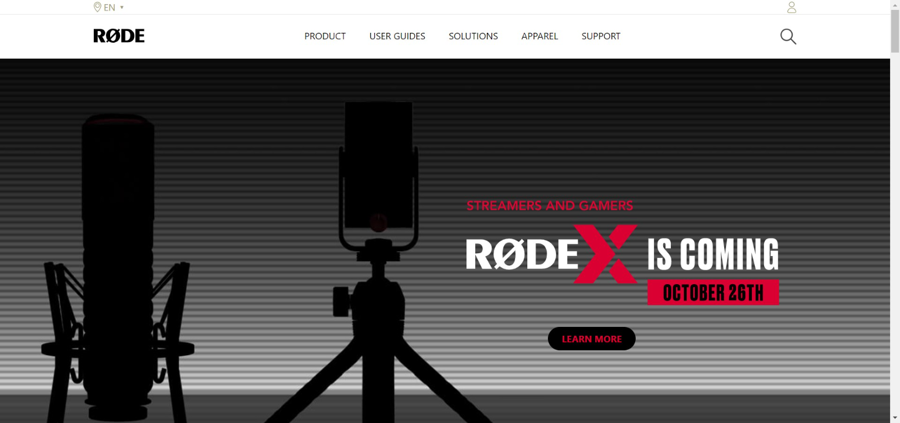

# 🔗**Project 18**

# 🌟 **Shopify UI Clone** 🌟

# 📌 ** Project Link 👇** 

**[RODE_UI_Clone](https://melodious-liger-e5cd1d.netlify.app/)**

# 📌 This Project is given in **"JavaScript Full stack Web Development Bootcamp"** by iNeuron.

This project is done by using **HTML5** and **TailWind CSS**.

# 📌 **Technology**

---------------------------------------------------

# 📸 **Thumbnail**

# **What I have learn from this project : 👇**

- Flexbox.
- TailWind CSS.
- Web responsive.
- TailwindCSS Positions.
- Box Shadow.
- Button Design
- Font Awesome.
- sticky navbar.
- navbar design
- desiging Cards

# 📌 **Acknowledgement**

Course Instructor - [Hitesh Choudhary]()